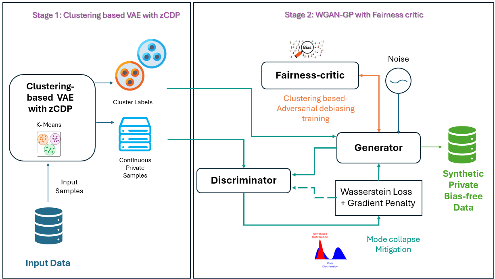

# Unsupervised Cluster-Based VAE–WGAN-GP for Fair and Privacy-Preserving Synthetic Data

This repository contains the research implementation of a hybrid generative framework for producing synthetic tabular data in unsupervised settings. The framework combines:

- a **Variational Autoencoder (VAE)** to learn a compact latent representation;
- **K-Means clustering** in the latent space to preserve unsupervised data structure;
- a **zero-Concentrated Differential Privacy (zCDP)** accounting component and noisy, clipped optimization in the VAE stage;
- a **Wasserstein GAN with Gradient Penalty (WGAN-GP)** to improve synthetic-data fidelity; and
- an adversarial **Fairness Critic** intended to reduce dependence between generated cluster structure and protected attributes.

The repository also includes an ablation without adversarial debiasing, six dataset-specific fairness evaluation scripts, and a shared realism evaluation script for comparing real and synthetic data.


## Motivation

Fairness-aware generators commonly require class or outcome labels, which restricts their use in unlabeled settings. Privacy-preserving generators can also reproduce latent associations with sensitive attributes. This project investigates a joint approach in which unsupervised clusters guide generation, zCDP is applied during latent-representation learning, and a fairness adversary penalizes sensitive-attribute predictability.

The intended objective is to balance three properties:

1. **Utility:** retain useful multivariate and cluster structure;
2. **Fairness:** limit associations between generated structure and protected attributes;
3. **Privacy:** bound information leakage through the stated zCDP mechanism and privacy accountant.

## Proposed architecture



The pipeline consists of the following stages:

1. **Input and preprocessing**
   - Load a preprocessed tabular CSV file.
   - Scale continuous features to the range expected by the output activation.
   - Encode categorical and protected attributes numerically, through one-hot encoding.

2. **Private cluster-based VAE**
   - Encoder: `input -> 512 -> 256 -> (mu, log-variance)`.
   - Latent dimension in the supplied Dataset 1 script: `20`.
   - Decoder: `latent -> 256 -> 512 -> reconstructed input` with a sigmoid output.
   - Training objective: reconstruction loss + KL-divergence term + distance-to-cluster-centroid term.
   - K-Means centroids are updated periodically from the learned latent representations.
   - The optimizer clips gradients and adds Gaussian noise; `zcdp_accountant.py` reports rho and converts it to an `(epsilon, delta)` value.

3. **WGAN-GP generation**
   - The reconstructed VAE output is passed to the adversarial stage.
   - Generator: `feature_dim -> 128 -> 256 -> 128 -> feature_dim`.
   - Data critic: `feature_dim -> 256 -> 128 -> 1`.
   - A gradient penalty with default weight `lambda_gp = 10` is used during critic training.

4. **Adversarial debiasing**
   - Generated samples are assigned to K-Means clusters.
   - One-hot cluster assignments are passed to the Fairness Critic.
   - The supplied Fairness Critic maps `number_of_clusters -> 128 -> 64 -> 2` and attempts to predict configured protected attributes.
   - The full generator objective combines adversarial and fairness terms. The ablation script omits this Fairness Critic and its loss.

5. **Synthetic-data postprocessing and evaluation**
   - Binary columns are thresholded at `0.5`; numerical columns retain continuous values.

   - Each `Fairness_evaluation_n.py` script is paired with `Dataset_n` and uses that dataset's own demographic attributes.
   - The fairness scripts cluster synthetic records after excluding the corresponding protected attributes.
   - They report protected-group cluster distributions, mutual information, silhouette score, and Davies–Bouldin index.
   - `Realism_evaluation.py` separately compares the generated records with their corresponding real data using the realism metrics implemented in that script.

   - The evaluation script clusters the synthetic records after excluding protected attributes.
   - It reports protected-group cluster distributions, mutual information, silhouette score, and Davies–Bouldin index.


## 🗂 Datasets

This work leverages multiple datasets, each with a dedicated tailored architecture:

- **Diabetes Health Indicators Dataset** – [Kaggle](https://www.kaggle.com/datasets/alexteboul/diabetes-health-indicators-dataset)
- **HIV Dataset** – [HealthGymAi](https://healthgym.ai/antiviral-hiv/)
- **Heart Failure Clinical Records** – [UCI Machine Learning Repository](https://doi.org/10.24432/C5Z89R)
- **Obesity Estimation Dataset** – [UCI Machine Learning Repository](https://doi.org/10.24432/C5H31Z)
- **Regensburg Pediatric Appendicitis Dataset** – [UCI Machine Learning Repository](https://archive.ics.uci.edu/dataset/938/regensburg+pediatric+appendicitis)
- **Corporate Stress Dataset** – [Kaggle](https://www.kaggle.com/datasets/ankitpatel2100/corporate-stress-dataset-insights-into-workplace)


## Repository structure

```text
Clust_VAE_WGAN_GP/
├── README.md
├── requirements.txt

├── Dataset_1/
│   ├── models/
│   ├── Architecture.py
│   ├── Architecture_WO_Adv_deb.py
│   └── zcdp_accountant.py
├── Dataset_2/                  # same training-file organization
├── Dataset_3/                  # same training-file organization
├── Dataset_4/                  # same training-file organization
├── Dataset_5/                  # same training-file organization
├── Dataset_6/                  # same training-file organization
├── Evaluations/
│   ├── Fairness_evaluation_1.py
│   ├── Fairness_evaluation_2.py
│   ├── Fairness_evaluation_3.py
│   ├── Fairness_evaluation_4.py
│   ├── Fairness_Evaluation_5.py
│   ├── Fairness_evaluation_6.py
│   └── Realism_evaluation.py
└── Architecture.png
```

Each `Dataset_n` directory contains the complete architecture, its ablation without adversarial debiasing, the local zCDP accountant, and the model checkpoints produced during training. Evaluation code is centralized under `Evaluations/` so that training and evaluation responsibilities remain clearly separated.

The numerical suffix establishes the dataset–evaluation correspondence:

| Dataset folder | Fairness evaluation file | Demographic attributes |
|---|---|---|
| `Dataset_1/` | `Evaluations/Fairness_evaluation_1.py` | Dataset 1 attributes; the supplied HIV example uses `Gender`, `Ethnic_2.0`, `Ethnic_3.0`, and `Ethnic_4.0`. |
| `Dataset_2/` | `Evaluations/Fairness_evaluation_2.py` | Dataset 2 demographic attributes, defined locally in this script. |
| `Dataset_3/` | `Evaluations/Fairness_evaluation_3.py` | Dataset 3 demographic attributes, defined locally in this script. |
| `Dataset_4/` | `Evaluations/Fairness_evaluation_4.py` | Dataset 4 demographic attributes, defined locally in this script. |
| `Dataset_5/` | `Evaluations/Fairness_Evaluation_5.py` | Dataset 5 demographic attributes, defined locally in this script. |
| `Dataset_6/` | `Evaluations/Fairness_evaluation_6.py` | Dataset 6 demographic attributes, defined locally in this script. |

```

Each `Dataset_n` directory should follow the same organization. Dataset-specific filenames, protected attributes, continuous columns, sample counts, and hyperparameters must be documented in its local `README.md` or in the dataset table below.

## Main files

| File | Purpose |
|---|---|

| `Dataset_n/Architecture.py` | Trains the complete dataset-specific cluster-based VAE + zCDP + WGAN-GP + Fairness Critic pipeline and generates synthetic samples. |
| `Dataset_n/Architecture_WO_Adv_deb.py` | Dataset-specific ablation that keeps the cluster-based VAE, privacy component, and WGAN-GP but removes adversarial debiasing. |
| `Dataset_n/zcdp_accountant.py` | Computes the zCDP privacy parameter and converts it to an `(epsilon, delta)` report for that experiment. |
| `Evaluations/Fairness_evaluation_n.py` | Evaluates `Dataset_n` using its own protected demographic attributes and reports fairness-related cluster statistics and clustering quality. |
| `Evaluations/Realism_evaluation.py` | Compares the real and generated datasets using the statistical realism measures implemented by the project. |
| `Architecture.png` | Presents the complete proposed architecture on the repository landing page. |
=======
| `Architecture.py` | Trains the complete cluster-based VAE + zCDP + WGAN-GP + Fairness Critic pipeline and generates synthetic samples. |
| `Architecture_WO_Adv_deb.py` | Ablation that keeps the cluster-based VAE, privacy component, and WGAN-GP but removes adversarial debiasing. |
| `Fairness_evaluation.py` | Computes protected-group cluster distributions, mutual information, silhouette score, and Davies–Bouldin index on a generated CSV file. |
| `zcdp_accountant.py` | Computes the zCDP privacy parameter and converts it to an `(epsilon, delta)` report. |
| `preprocessed_*.csv` | Dataset-specific model input. Replace the wildcard with the exact documented filename. |

## Data requirements and organization

The training scripts expect a numeric CSV matrix with one row per record and one column per model feature.


The datasets are obtained from their official or referenced access pages and are not necessarily distributed with this repository. Place each preprocessed input in its matching `Dataset_n/` folder, or update the path in the corresponding architecture script. Real and generated file paths used for evaluation must likewise be configured in the matching script under `Evaluations/`.

=======

Before training:

- remove exported index columns such as `Unnamed: 0`;
- impute or otherwise handle missing values consistently;
- scale numerical features consistently with the sigmoid output used by the current models, normally to `[0, 1]`;
- encode categorical features numerically;
- retain the protected attributes required by the fairness experiment;
- ensure that protected-attribute names in the code match the CSV columns exactly; and
- record every preprocessing step to make the experiment reproducible.

## Requirements

- Python 3.10 or later is recommended.
- A CUDA-capable GPU is optional; PyTorch falls back to CPU when CUDA is unavailable.
- Install a PyTorch build compatible with the local operating system and CUDA version.

The Python dependencies imported by the supplied scripts are:

```text
numpy
pandas
torch
scikit-learn
scipy
matplotlib
```


=======
A minimal `requirements.txt` can therefore contain:

```text
numpy>=1.24
pandas>=2.0
torch>=2.1
scikit-learn>=1.3
scipy>=1.10
matplotlib>=3.7
```


For exact reproduction, replace broad lower bounds with the versions used in the published experiments and provide the Python, CUDA, and operating-system versions.

## Installation

```bash

git clone https://github.com/AdouaniMalek/Unsupervised_Cluster_based_VAE_WGAN_GP
=======
git clone <REPOSITORY_URL>

cd Clust_VAE_WGAN_GP

python -m venv .venv
```

Activate the environment on Windows PowerShell:

```powershell
.venv\Scripts\Activate.ps1
python -m pip install --upgrade pip
pip install -r requirements.txt
```

Activate it on Linux or macOS:

```bash
source .venv/bin/activate
python -m pip install --upgrade pip
pip install -r requirements.txt
```

## Configuration before execution

The current scripts contain dataset-specific constants and hard-coded absolute Windows paths. For each `Dataset_n` folder, verify or update:

- `dataset_directory` or `dataset_dir`;
- the input CSV filename;
- `protected_attributes`;
- `numerical_columns` and binary-column postprocessing;
- `num_clusters`;
- `latent_dim`;
- VAE and WGAN epoch counts;
- batch size and learning rates;
- gradient-clipping norm and noise multiplier;
- fairness-loss weight and gradient-penalty weight; and
- `num_fake_samples`.

For portability, the scripts should preferably derive their directory from the file location:

```python
from pathlib import Path

dataset_directory = Path(__file__).resolve().parent
df = pd.read_csv(dataset_directory / "preprocessed_HIV.csv")
model_directory = dataset_directory / "models"
model_directory.mkdir(parents=True, exist_ok=True)
```
## Running an experiment


The training scripts are executed independently for each dataset. The following commands assume that the terminal starts at the repository root.
=======
The scripts are currently executed independently for each dataset.


### 1. Run the complete architecture

```bash

cd Dataset_1
python Architecture.py
```

Replace `Dataset_1` with `Dataset_2`, ..., `Dataset_6` to train another dataset. Return to the repository root before selecting another folder:

```bash
cd ..
```

=======

python Architecture.py
```


For each Dataset, the supplied script writes a generated file following this pattern:

```text
gen_samp_rho<RHO>_epsilon<EPSILON>.csv
```

It also saves the trained VAE, generator, discriminator, and Fairness Critic weights in the configured `models/` directory.

### 2. Run the ablation without adversarial debiasing

```bash
python Architecture_WO_Adv_deb.py
```

The supplied ablation writes a file following this pattern:

```text
gen_samp_WO_Adv_Deb_Epsilon_<EPSILON>.csv
```

Use the same preprocessing, split, random seeds, generation count, and privacy configuration as the complete model when making an ablation comparison.

### 3. Evaluate fairness and clustering quality


Return to the repository root. In the fairness file corresponding to the dataset, configure the synthetic-data path, the protected attributes, and the number of clusters. For Dataset 1, edit `Evaluations/Fairness_evaluation_1.py`:
=======
In `Fairness_evaluation.py`, set:


```python
dataset_dir = "/path/to/Clust_VAE_WGAN_GP/Dataset_1"
file_path = os.path.join(dataset_dir, "<GENERATED_FILE>.csv")

protected_attributes = ["Gender", "Ethnic_2.0", "Ethnic_3.0", "Ethnic_4.0"]
num_clusters = 20
=======
protected_attributes = ["Determined in each script according to its corresponding demographic attributes"]
num_clusters = K

```

Then run:

```bash

python Evaluations/Fairness_evaluation_1.py
```

Use the matching suffix for the other datasets:

```bash
python Evaluations/Fairness_evaluation_2.py
python Evaluations/Fairness_evaluation_3.py
python Evaluations/Fairness_evaluation_4.py
python Evaluations/Fairness_Evaluation_5.py
python Evaluations/Fairness_evaluation_6.py
```

Do not reuse Dataset 1's demographic columns automatically. Each fairness script must retain the protected attributes belonging to its corresponding dataset and must exclude those same columns from the clustering features.

=======
python Fairness_evaluation.py
```


The evaluation script reports:

- cluster proportions conditional on each protected attribute;
- mutual information between each protected attribute and cluster membership;
- silhouette score; and
- Davies–Bouldin index.

### Metric interpretation

| Metric | Interpretation |
|---|---|
| Protected-group cluster distribution | Compare the cluster distribution across groups for each protected attribute. Similar distributions indicate less group-dependent cluster allocation. |
| Mutual information | `0` indicates statistical independence in the empirical sample; larger values indicate stronger dependence. Values are not directly comparable across all attributes unless normalization and support sizes are considered. |
| Silhouette score | Higher is better; values near `1` indicate compact, well-separated clusters, values near `0` indicate overlap, and negative values can indicate poor assignments. |
| Davies–Bouldin index | Lower is better; it summarizes within-cluster dispersion relative to between-cluster separation. |

The labels `Evenly Spread`, `Balanced`, and `Unbalanced` in the supplied evaluation script are based on project-specific thresholds (`0.05` and `0.15`). They are heuristic reporting categories, not generally accepted fairness thresholds. The script uses `KMeans`, despite a comment that refers to a Gaussian mixture model.


### 4. Evaluate statistical realism

Configure the real and generated CSV paths required by `Evaluations/Realism_evaluation.py`, then run it from the repository root:

```bash
python Evaluations/Realism_evaluation.py
```

This evaluation is kept separate from the fairness scripts because it compares real and synthetic distributions, whereas each fairness script depends on dataset-specific demographic attributes. Use the same preprocessing and column order for the real and synthetic inputs, and report the realism metrics separately for each dataset.

=======

## Default Dataset configurations

| Component | Parameter | Full model | Without adversarial debiasing |
|---|---|---:|---:|
| VAE | Latent dimension | 20 | 20 |
| VAE | Number of clusters | 15 | 15 |
| VAE | Batch size | 86 | 86 |
| VAE | Learning rate | `1e-4` | `1e-4` |
| VAE | Epochs | 20 | 20 |
| VAE | Cluster update interval | 10 epochs | 10 epochs |
| Privacy | Gradient clipping norm | 0.5 | 0.5 |
| Privacy | Noise multiplier variable | 0.0031 | 0.002 |
| Privacy | Target delta | `1e-5` | `1e-5` |
| WGAN-GP | Generator learning rate | `1e-4` | `1e-4` |
| WGAN-GP | Critic learning rate | `1e-2` | `1e-2` |
| WGAN-GP | Epochs | 15 | 15 |
| WGAN-GP | Gradient-penalty weight | 10 | 10 |
| Fairness | Fairness Critic learning rate | `1e-2` | Not applicable |
| Fairness | Fairness weight in generator loss | 0.1 | Not applicable |

These values document the supplied Dataset 1 scripts; they should not be assumed to apply to Datasets 2–6.

## Reproducibility checklist

Before publishing results or comparing the full and ablated models:

- report exact package and hardware versions;
- use explicit random seeds for NumPy, PyTorch, CUDA, and K-Means;
- keep train/test partitions fixed across models;
- fit preprocessing only on the training data;
- report the exact number of optimizer steps used by the privacy accountant;
- ensure the privacy accountant matches the implemented sampling and noise mechanism;
- keep privacy budgets equal in controlled ablations unless privacy is the ablated component;
- report mean, dispersion, and number of repeated runs;
- evaluate utility, fairness, privacy, and statistical fidelity on held-out data where applicable; and
- document all dataset-specific protected-attribute mappings.

## Known implementation notes

- The scripts are notebook-style Python files with `# %%` cells and dataset-specific constants.
- Output CSV files are written to the current working directory unless an explicit output path is added.

- The six fairness scripts are dataset-specific. A change to demographic columns in one dataset must be reflected only in its corresponding `Fairness_evaluation_n.py` file.
- The Dataset 1 fairness example loads the original dataset into `dfo`, but the supplied version does not subsequently use that object.
=======
- `Fairness_evaluation.py` loads the original dataset into `dfo`, but the supplied version does not subsequently use that object.

- `chi2_contingency` is imported by the supplied evaluation example but is not used in the reported metrics.
- `binary_cross_entropy_with_logits` expects raw logits; if the Fairness Critic retains a final sigmoid layer, use binary cross-entropy on probabilities instead, or remove the sigmoid and keep the logits-based loss.
- The WGAN critic conventionally returns an unconstrained scalar. The current discriminator ends with a sigmoid; this should be reviewed against the intended WGAN-GP formulation before exact reproduction claims are made.

## References

- D. P. Kingma and M. Welling, [Auto-Encoding Variational Bayes](https://arxiv.org/abs/1312.6114), 2013.
- I. Gulrajani, F. Ahmed, M. Arjovsky, V. Dumoulin, and A. Courville, [Improved Training of Wasserstein GANs](https://arxiv.org/abs/1704.00028), 2017.
- M. Bun and T. Steinke, [Concentrated Differential Privacy: Simplifications, Extensions, and Lower Bounds](https://arxiv.org/abs/1605.02065), 2016.
- [scikit-learn K-Means documentation](https://scikit-learn.org/stable/modules/generated/sklearn.cluster.KMeans.html).
- [scikit-learn silhouette score documentation](https://scikit-learn.org/stable/modules/generated/sklearn.metrics.silhouette_score.html).
- [scikit-learn Davies–Bouldin score documentation](https://scikit-learn.org/stable/modules/generated/sklearn.metrics.davies_bouldin_score.html).

## Citation

If you use this code, please cite the associated paper. Replace the placeholder below with the final bibliographic record and DOI:

```bibtex
@InProceedings{clust_vae_wgan_gp,
author="Adouani, Malek
and Chelly Dagdia, Zaineb",

title="Fair and Privacy-Preserving Synthetic Data Generation via Clustering-Based Variational Autoencoder and Adversarially Debiased Wasserstein Generative Adversarial Networks with Gradient Penalty",
booktitle="Machine Learning and Knowledge Discovery in Databases. Research Track",
year="2026",
publisher="Springer Nature Switzerland",

pages="195--212",
}
```

## Acknowledgement

This work was supported by the France 2030 grants RHU RECORDS (ANR-18-RHUS-0004) and IHU PROMETHEUS (ANR-23-IAHU-0004) and the iRECORDS project, funded by ERA PerMed (JTC_2021).

=======


